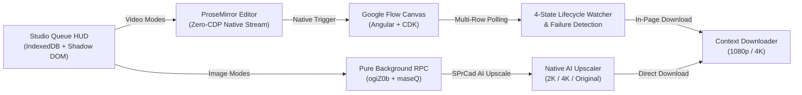

# RJ V-Flow Auto


> **Advanced AI Video & Image Automation Studio for Google Flow (`flow.google.com`)**  
> Engineered for Chromium browsers (Google Chrome, Microsoft Edge, Brave) using Chrome Manifest V3.

---

## Architecture Overview



---

## Key Features

- **Dual-Pipeline Execution Architecture**:
  - *Video Pipeline*: Native ProseMirror document insertion (`execCommand('insertText')` + native `input` events) and native click triggers with pre-armed reCAPTCHA Enterprise tokens. Zero bot flags, zero debugger banners.
  - *Image Pipeline*: Pure background RPC generation (`ogiZ0b`) and reference uploads (`maseQ`) with zero DOM clicks and zero synthetic preview tiles.
- **Native AI Image Upscaling (`SPrCad`)**: Google Flow native AI upscaling directly to 2K (`code: 1`) and 4K (`code: 2`) with automatic tiered fallback (`4K -> 2K -> 1K/Original`) for free accounts or quota limits.
- **Multi-Language Resilient DOM Engine**: Driven by Google Material Symbols font ligatures (`settings_2`, `arrow_forward`, `download`, `more_vert`, `dashboard`, `left_panel_close`, `ink_eraser`, `chrome_extension`) and positional Left-to-Right (LTR) structural indexing for tile sizes. 100% resilient across English, Indonesian, Spanish, Japanese, German, and French interfaces.
- **Finished Queue Dual Action Buttons**: When queue execution completes or stops gracefully, the start button transforms into `Clear all` (wipes queue to dropzone) and `Reset queue` (restores rows to `READY` while preserving 100% of prompt text, uploaded ingredients, frames, and parameters).
- **Dual-Mode Studio UI (Raycast Dark Precision)**:
  - *Toolbar Popup*: Minimalist platform connection detector and instant launcher.
  - *In-Page Studio Overlay HUD*: Shadow DOM encapsulated 2-column workspace (Queue Builder + Parameters Sidebar) minimizable into a compact draggable floating status pill.
- **IndexedDB Binary Storage Engine (`FlowImageDB`)**: Stores high-resolution reference images, start/end frames, and media ingredients directly in browser IndexedDB (`vflowImageDB`) under unique UUIDs, bypassing Chrome's strict 5MB `chrome.storage.local` quota limit.
- **Comprehensive Media Workflows**:
  - Pure Text-to-Video & Text-to-Image batch processing.
  - Image-to-Video (I2V) and Edit Image reference ingestion.
  - Frame-to-Video (F2V) start & end frame interpolation with sequential ProseMirror injection.
  - Smart media drag-and-drop: automatically switches modes and configures rows based on dropped file count.
- **Model Family Support**:
  - *Video Generation*: **Veo 3.1** (`Lite`, `Fast`, `Quality`) and **Omni 1.1 Flash** (durations 4s–10s, output counts x1–x4).
  - *Image Generation*: **Nano Banana** family (`2`, `Pro`, `2 Lite`).
- **4-State Generation Lifecycle Watcher**: Evaluates tile states (`PENDING_RENDERING`, `BLANK_TRANSITION`, `DEFINITIVE_SUCCESS`, `DEFINITIVE_FAILURE`) with a 10-second grace timer for transient blank rendering phases, preventing false failure timeouts.
- **Virtual Scroll Multi-Row Batch Collection**: Seamlessly tracks tiles across multiple virtual scroll rows (`div.tile-row`), resolving landscape 16:9 multi-output download clipping issues.
- **In-Card Failure & Moderation Resilience**: Evaluates asset tile health directly in the gallery grid, bypassing downloads for blocked prompts and preventing automation lockups without relying on toasts.
- **Studio HUD Polishing & Ergonomics**:
  - *Clean Mount Protocol*: Pre-hidden select inputs, stylesheet loading gates, and mount-time transition suppression eliminate initial white border flashes (FOUC).
  - *Graceful Stop Engine*: Allows currently generating and downloading items to finish safely before halting the queue cleanly.
  - *Sort Mode & Drag Reordering*: Interactive HTML5 row reordering and universal media slot click-to-swap.
  - *Dynamic Outline Glow*: Hardware-accelerated SVG border glow loop on active generating rows.
  - *Execution Form Locking*: Locks inputs, selects, and textareas during execution while allowing read-only row inspection on click.
  - *One-Time Page Setup*: Automatically collapses the left project navigation sidebar and configures Grid view Size S and auto-clear prompt.
- **Strict Zero Native Emoji Policy**: Pure modern interface styled with Raycast Dark tokens and clean Lucide SVG icons.

---

## Installation & Getting Started

### Option 1: Production Installation (Recommended)

1. Download the latest release package (`vX.Y.Z.zip`) from the [`releases/`](releases/) directory and extract it.
2. Open your Chromium browser (Chrome / Edge / Brave) and navigate to:
   ```
   chrome://extensions/
   ```
3. Enable the **Developer mode** toggle in the top right corner.
4. Click **Load unpacked** (*Muat yang belum dibongkar*).
5. Select the extracted **`dist/LOAD THIS FOLDER/`** directory:
   ```
   path/to/extracted/dist/LOAD THIS FOLDER
   ```
6. Navigate to `https://flow.google.com/` and launch the Studio HUD!

---

### Option 2: Developer Installation (From Source)

1. Clone this repository:
   ```bash
   git clone https://github.com/riiicil/rj-vflow-auto.git
   ```
2. Open `chrome://extensions/` in your browser.
3. Enable **Developer mode**.
4. Click **Load unpacked** and select the **`src/`** directory:
   ```
   path/to/RJ_V-Flow_Auto/src
   ```
5. Navigate to `https://flow.google.com/`.

---

## Building from Source

The repository includes a production bundling and obfuscation pipeline mirroring modern extension standards:

```bash
# Install build dependencies
npm install

# Run production build and generate release package
npm run build
```

The build pipeline:
- Bundles all internal ES modules into standalone scripts using `esbuild`.
- Applies AST obfuscation with Manifest V3 compatibility via `javascript-obfuscator`.
- Copies extension assets and distribution links into `dist/LOAD THIS FOLDER/`.
- Generates compressed release archives in `releases/`.

---

## Documentation

Full architectural documentation is maintained under `docs/`:

- [`docs/ARCHITECTURE.md`](docs/ARCHITECTURE.md) — MV3 architecture, sequence flows, and component design.
- [`docs/CURRENT_STATE.md`](docs/CURRENT_STATE.md) — Living project dashboard and active inventory.
- [`docs/HANDOFF.md`](docs/HANDOFF.md) — Operational continuity briefing and platform gotchas.
- [`docs/ROADMAP.md`](docs/ROADMAP.md) — Phased engineering roadmap and milestone breakdown.
- [`docs/DECISIONS.md`](docs/DECISIONS.md) — Architectural Decision Records (ADR-001 through ADR-015).
- [`docs/references/GOOGLE_FLOW_DOM.md`](docs/references/GOOGLE_FLOW_DOM.md) — Precision DOM selector map.

---

## License & Support

Distributed under the MIT License. See [`LICENSE`](LICENSE) for details.  
Copyright (c) 2026 Riiicil.
