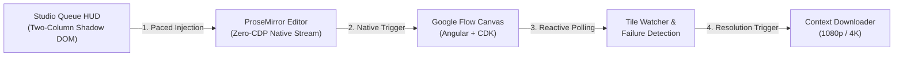

# RJ V-Flow Auto (Next-Gen v3.0)


> **Advanced AI Video & Image Automation Studio for Google Flow (`flow.google.com`)**  
> Engineered for Chromium browsers (Google Chrome, Microsoft Edge, Brave) using Chrome Manifest V3.

---

## Architecture Overview



---

## Key Features

- **100% Native Event Stream (Zero-CDP)**: Completely eliminates Chrome DevTools Protocol (`chrome.debugger`) in favor of native ProseMirror document insertion (`execCommand('insertText')` + native `input` events). Zero bot flags, zero debugger banners.
- **Multi-Language Resilient**: Driven by Google Material Symbols font ligatures (`settings_2`, `arrow_forward`, `download`, `more_vert`) and custom Angular element scopes. Operates seamlessly on English, Indonesian, Spanish, Japanese, French, and any browser locale.
- **Dual-Mode Studio UI (Raycast Dark Precision)**:
  - *Toolbar Popup*: Minimalist platform connection detector and instant launcher.
  - *In-Page Studio Overlay HUD*: Shadow DOM encapsulated 2-column workspace (Queue Builder + Parameters Sidebar) minimizable into a compact draggable status pill.
- **Next-Gen Model Family Support**:
  - *Video Generation*: **Veo 3.1** (`Fast`, `Lite`, `Quality`) and **Omni 1.1 Flash** (with durations 4s–10s and video-to-video ingredients).
  - *Image Generation*: **Nano Banana** family (`Pro`, `2`, `2 Lite`).
- **Comprehensive Media Workflows**:
  - Pure Text-to-Video & Text-to-Image batch processing.
  - Image-to-Video (I2V) and Video-to-Video reference injection via clipboard paste.
  - Frame-to-Video (F2V) start & end frame interpolation.
- **In-Card Failure & Moderation Resilience**: Evaluates asset tile health directly in the gallery grid, bypassing downloads for blocked prompts and preventing automation lockups without relying on toasts.
- **Automatic High-Resolution Downloads**: Automates the asset context menu to trigger upscaled resolution downloads (`1080p` for video, `2K`/`4K` for images).
- **Strict Zero Native Emoji Policy**: Pure modern interface styled with Raycast Dark tokens and clean Lucide SVG icons.

---

## Installation & Getting Started

### Developer Installation (From Source)

1. Clone this repository:
   ```bash
   git clone https://github.com/riiicil/rj-vflow-auto.git
   ```
2. Open your Chromium browser (Chrome / Edge / Brave) and navigate to:
   ```
   chrome://extensions/
   ```
3. Enable **Developer mode** toggle in the top right corner.
4. Click **Load unpacked** (*Muat yang belum dibongkar*).
5. Select the **`src/`** directory of this repository:
   ```
   path/to/RJ_V-Flow_Auto/src
   ```
6. Navigate to `https://flow.google.com/` and start automating your creative vision!

---

## Documentation

Full architectural documentation is maintained under `docs/`:

- [`docs/ARCHITECTURE.md`](docs/ARCHITECTURE.md) — MV3 architecture, sequence flows, and component design.
- [`docs/CURRENT_STATE.md`](docs/CURRENT_STATE.md) — Living project dashboard and active tasks.
- [`docs/HANDOFF.md`](docs/HANDOFF.md) — Session continuity briefing and platform gotchas.
- [`docs/ROADMAP.md`](docs/ROADMAP.md) — Phased refactoring roadmap and commit milestones.
- [`docs/references/GOOGLE_FLOW_DOM.md`](docs/references/GOOGLE_FLOW_DOM.md) — Precision DOM selector map.

---

## License & Support

Distributed under the MIT License. See [`LICENSE`](LICENSE) for details.  
Copyright (c) 2026 Riiicil.
