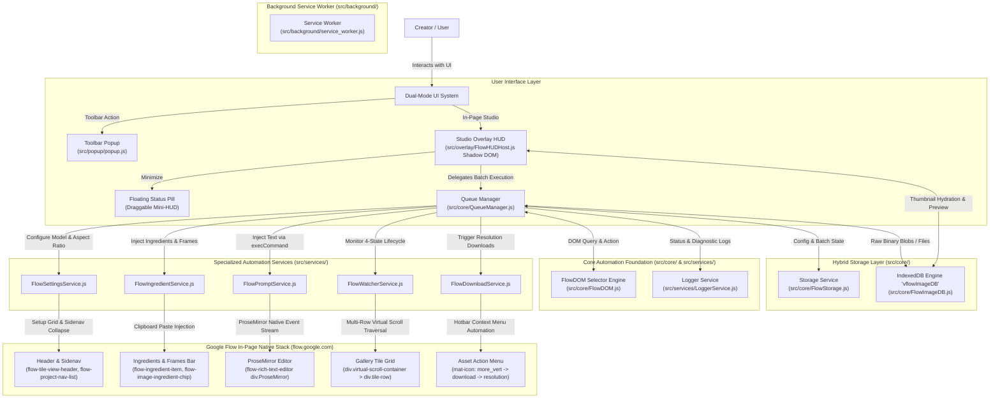
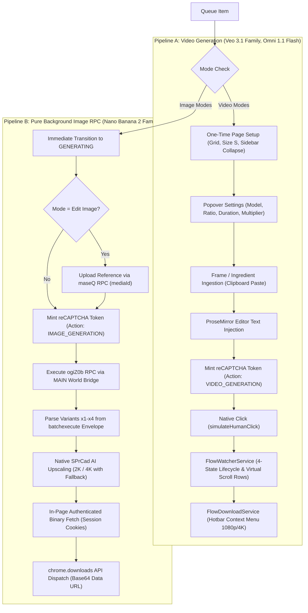

# Architecture — RJ V-Flow Auto

## 1. System Overview

**RJ V-Flow Auto** is a Chromium browser extension (Manifest V3) specifically engineered for automated multi-mode AI image and video generation on **Google Flow** (`flow.google.com`).

The extension eliminates the fragile, deprecated Chrome DevTools Protocol (`chrome.debugger`) architecture of legacy v2.x in favor of a clean, modern **Zero-CDP Native Event Stream Protocol**, an in-page **Studio Overlay HUD** encapsulated in Shadow DOM, a **Hybrid Storage Architecture** combining IndexedDB and `chrome.storage.local`, and a **4-State Lifecycle Watcher** supporting multi-row virtual scroll collection.



---

## 2. Technology Stack

| Layer | Technology | Purpose & Architectural Notes |
| :--- | :--- | :--- |
| **Platform Standard** | Chrome Manifest V3 (MV3) | Modern browser extension standard for Chromium browsers |
| **Runtime & Architecture** | Vanilla JavaScript (ES6 Modules) | Zero bundler bloat during active development; 100% native browser module imports in `src/` |
| **Production Bundler** | `esbuild` + `javascript-obfuscator` | Bundle-first release pipeline inlining 18 modules into a single obfuscated `content_main.js` (218.7kb) |
| **Design System** | Raycast Dark Precision | Dark canvas `#07080a`, surface `#0d0d0d`, elevated `#101111`, card `#121212`, hairline `#242728`, accent cyan `#079183`, accent green `#59d499`, accent red `#ff6161` |
| **Iconography** | Lucide / Phosphor SVG Icons | Scalable inline vector components. Strict Zero Native Emoji policy |
| **UI Encapsulation** | Open-Mode Shadow DOM (`#flow-auto-hud-root`) | Complete bidirectional style isolation between Google Flow and Extension HUD |
| **Storage Architecture** | Hybrid: IndexedDB + `chrome.storage.local` | High-res image binaries in IndexedDB (`vflowImageDB`); metadata, queue, and settings in `chrome.storage.local` |
| **DOM Protocol** | Zero-CDP Native Event Stream | Text injection via `execCommand('insertText')` + native `InputEvent` & button clicks |
| **Target Framework** | Angular Custom Elements + Angular Material & CDK | Target platform on `flow.google.com` |

---

## 3. Zero-CDP Protocol Deep Dive

### A. Why CDP (`chrome.debugger`) Was Purged
In legacy v2.x, the extension attached Chrome DevTools Protocol (`chrome.debugger`) to simulate `isTrusted: true` events under the erroneous assumption that Google Flow's editor was Slate.js / React.

This legacy approach had severe drawbacks:
1. **Intrusive Warning Banners**: Chrome displays a prominent yellow banner (`"RJ V-Flow Auto started debugging this browser"`), creating poor user trust.
2. **Anti-Bot & Security Triggers**: Automated debugging sessions trigger anti-bot heuristics on Google infrastructure, risking account restrictions.
3. **Session Fragility**: Network disconnections, tab reloads, or unexpected popup closures frequently detached the debugger, bricking the automation pipeline.

### B. The Native Event Stream Alternative
Reverse engineering confirmed that Google Flow runs on **Angular Custom Elements** (`<flow-*>`) with a native **ProseMirror** rich text editor (`flow-rich-text-editor div.ProseMirror`).

ProseMirror does **not** require CDP or `isTrusted: true` synthetic events. It natively listens to standard browser input streams:
1. **Focus Target**: Focus `div.ProseMirror` using `editor.focus()`.
2. **Clean Slate**: Initialize with `<p><br class="ProseMirror-trailingBreak"></p>`.
3. **Native Text Injection**: Execute `document.execCommand('selectAll', false, null)` followed by `document.execCommand('insertText', false, promptText)`. This triggers ProseMirror's internal document transaction natively.
4. **Input Event Dispatch**: Dispatch a native `new InputEvent('input', { bubbles: true, cancelable: true, inputType: 'insertText', data: promptText })`.
5. **Form Submission**: Dispatch `.click()` on the native generate button (`button.generate-icon-button` / ligature `arrow_forward`) with sequential settle delays (350ms pre-submit, 600ms post-trigger).

---

## 4. Google Flow Native Subsystems & Integration Points

### A. Material Symbols Ligature Mechanics (Multi-Language Resilience)
Google Flow relies on the Google Material Symbols ligature font for its iconography:

```html
<mat-icon class="mat-icon material-symbols-outlined">settings_2</mat-icon>
<mat-icon class="mat-icon material-symbols-outlined">more_vert</mat-icon>
<mat-icon class="mat-icon material-symbols-outlined">download</mat-icon>
<mat-icon class="mat-icon material-symbols-outlined">dashboard</mat-icon>
<mat-icon class="mat-icon material-symbols-outlined">left_panel_close</mat-icon>
<mat-icon class="mat-icon material-symbols-outlined">ink_eraser</mat-icon>
<mat-icon class="mat-icon material-symbols-outlined">chrome_extension</mat-icon>
```

Ligature font mechanics translate character strings into vector glyphs in the rendering engine. Consequently:
- Ligature text nodes (`"settings_2"`, `"more_vert"`, `"download"`, `"arrow_forward"`, `"swap_horiz"`, `"cancel"`, `"dashboard"`, `"left_panel_close"`, `"ink_eraser"`, `"chrome_extension"`, `"redo"`) are internal font identifiers.
- **They are never translated by Google Translate or browser language locales.**
- Selectors querying ligatures are 100% resilient across English, Spanish, Indonesian, Japanese, German, and French interfaces.
- **Positional LTR Indexing**: For controls lacking distinct font ligatures (such as the tile size options: `S/M/L` in English vs `K/S/B` in Indonesian), the engine identifies the 3-button toggle group (`mat-button-toggle-group:not(:has(mat-icon))`) and resolves selections by screen Left-to-Right coordinate index (index 0 = Small, index 1 = Medium, index 2 = Large), guaranteeing 100% language independence.

### B. One-Time Page Setup & Sidenav Collapse
At the start of queue execution, [`FlowSettingsService`](file:///c:/Users/admin/Desktop/git/RJ_V-Flow_Auto/src/services/FlowSettingsService.js) executes an automated one-time page setup:
1. **Left Navigation Panel Auto-Collapse**: Invokes `ensureSidebarCollapsed()`. If expanded (`left_panel_close`), clicks to collapse it, preventing overlay overlap.
2. **Grid View & Size S Configuration**: Opens `settings_2`, verifies Grid layout (`dashboard`), toggles Tile Size S (`GRID_SIZE_S_TOGGLE` via positional LTR index 0), and ensures Auto-Clear Prompt switch (`button[name="clear-prompt-on-submit"]` or ligature `ink_eraser`) is enabled.
3. **Creative Agent Mode Suppression**: Inspects `button.agent-mode-chip-checked` and clicks to disable it with detailed audit logging.

### C. Dual-Pipeline Execution Architecture (Video vs Image)

Google Flow employs fundamentally distinct runtime flows for video and image generation:



1. **Pipeline A — Native DOM Stream Protocol (Video Modes)**:
   - Targets Google Flow's Angular Material DOM directly.
   - Text is injected natively via `execCommand('insertText')` + `InputEvent`.
   - Start and End frames for Frame-to-Video are pasted sequentially into the editor.
   - Triggers submission using `simulateHumanClick` with pre-armed reCAPTCHA Enterprise tokens minted in the MAIN world.
   - Monitored by `FlowWatcherService` across virtual scroll rows until reaching definitive success.
   - Assets are downloaded via hotbar context menu automation (`more_vert -> download`).

2. **Pipeline B — Pure Background RPC Protocol (Image Modes)**:
   - 100% decoupled from page DOM: zero text injection, zero button clicks, zero popovers, zero synthetic gallery tiles.
   - References for `edit-image` mode are uploaded via internal `maseQ` batchexecute RPC.
   - Generation executes via internal `ogiZ0b` batchexecute RPC with minted reCAPTCHA tokens.
   - Outputs are upscaled via native `SPrCad` AI upscaler (2K `code: 1`, 4K `code: 2`) with tiered fallback (`4K -> 2K -> 1K/Original`).
   - Binaries are fetched authenticated in-page and downloaded directly via `chrome.downloads`.

---

## 5. Hybrid Storage Architecture (`FlowImageDB` + `FlowStorage`)

### A. IndexedDB Binary Persistence Engine (`FlowImageDB.js`)
Storing high-resolution image files in `chrome.storage.local` quickly violates Chrome's strict 5MB quota limit.  
`FlowImageDB` implements a local browser IndexedDB instance (`vflowImageDB`, store `images`) that stores raw `Blob` and `File` binaries keyed by UUID (`img_{timestamp}_{random}`).

### B. Quota Sanitization & Preview Hydration
- **Sanitization on Save**: [`FlowStorage.sanitizeQueueForStorage()`](file:///c:/Users/admin/Desktop/git/RJ_V-Flow_Auto/src/core/FlowStorage.js#L179-L209) strips large Base64 `dataUrl` strings from queue items whenever an `imageId` is present before persisting metadata to `chrome.storage.local`.
- **Preview Hydration**: When the Studio HUD initializes or re-renders, [`hydrateQueuePreviews()`](file:///c:/Users/admin/Desktop/git/RJ_V-Flow_Auto/src/overlay/FlowHUDHost.js#L189-L220) fetches binaries from IndexedDB and creates in-memory object URLs (`URL.createObjectURL(blob)`), ensuring thumbnails render instantaneously without persisting bloated data in extension storage.

---

## 6. 4-State Generation Lifecycle & Multi-Row Virtual Scroll Watcher

### A. 4-State Lifecycle Protocol
Google Flow tile generation passes through four distinct phases evaluated by [`FlowWatcherService.getTileStatus()`](file:///c:/Users/admin/Desktop/git/RJ_V-Flow_Auto/src/services/FlowWatcherService.js#L120-L255):
1. **`DEFINITIVE_SUCCESS`**: Valid playable media element (`video[src]` or `img[src]`) present, progress bar absent, and no error badges.
2. **`DEFINITIVE_FAILURE`**: Tile contains `<flow-error-tile>`, `.error-tile`, `warning` ligature, or `.failed` class.
3. **`PENDING_RENDERING`**: Active `<flow-pending-tile>`, visible progress bar, or live percentage ticker (`XX%`).
4. **`BLANK_TRANSITION`**: The 300ms–2000ms window where the progress bar has disappeared but the rendered media source has not yet mounted. A 10-second grace timer protects against false failure timeouts.

### B. Multi-Row Virtual Scroll Batch Collection
In Google Flow's Size S grid layout, multi-output runs (e.g. landscape 16:9 x3 or x4) span across multiple rows (`div.virtual-scroll-container > div.tile-row`).  
[`getBatchTileElements()`](file:///c:/Users/admin/Desktop/git/RJ_V-Flow_Auto/src/services/FlowWatcherService.js#L59-L111) collects all cards belonging to the batch across all rows up to `expectedCount`, stopping at `previousTopTile`. User-uploaded ingredient tiles are filtered out via [`isIngredientTile()`](file:///c:/Users/admin/Desktop/git/RJ_V-Flow_Auto/src/core/FlowDOM.js#L375-L403).

---

## 7. Dual-Mode UI & Shadow DOM Studio HUD

### A. Minimalist Toolbar Popup (`src/popup/`)
- Compact 320px footprint.
- Real-time tab inspection toggling State 1 (Disconnected) vs State 2 (Connected to Google Flow).
- Direct launch button to focus or open `flow.google.com`.

### B. In-Page Studio Overlay HUD (`src/overlay/`)
- **Shadow DOM Encapsulation**: Mounted into `#flow-auto-hud-root` with an open shadow root, guaranteeing 100% style isolation from Angular Material.
- **Clean Mount Protocol**: Select dropdowns are pre-hidden inline (`display: none`), stylesheets are loaded via `Promise.all` with a 150ms timeout gate, and `.is-mounting` suppresses initial CSS transitions, completely eliminating white border flash (FOUC).
- **Two-Column Studio Layout**:
  - *Left Column (Queue Builder)*: Toolbar (multi-select, batch/single param mode, bulk delete, sort mode, add row), dynamic dropzone, and queue rows with 50px textareas matching media slots.
  - *Right Column (Parameters Sidebar)*: Generation mode, model selector, duration/aspect ratio, output multiplier, and target resolution with smart container-aware `.dropup` flipping.
- **Collapsible Floating Pill**: Minimizes into a compact draggable status pill with synchronized live status reporting (`Idle`, `X queued`, `Processing X/Y (Z%)`).
- **Interactive Controls & Safety**:
  - *Animated Border Glow*: Looping hardware-accelerated SVG glow on active generating rows.
  - *Execution Form Locking*: Locks all form controls during active runs while keeping row containers clickable for read-only parameter inspection.
  - *Graceful Stop Engine*: Supports `QUEUE_STATES.STOPPING`, finishing active generation and download before halting cleanly.
  - *Sort Mode Reordering & Click-to-Swap*: HTML5 drag-and-drop row reordering and slot click-to-swap.
  - *Finished Queue Dual Action Buttons*: When queue processing completes or halts, the start button transforms into `#btnClearAllQueue` (`Clear all`) and `#btnResetQueue` (`Reset queue`). Resetting returns rows to `READY` while preserving all prompt texts, uploaded media, and parameter bindings.

---

## 8. In-Page Download Automation (`FlowDownloadService.js`)

Downloads execute purely within the browser tab context:
1. **Context Menu Automation**: Locates `more_vert` inside the card hotbar (using `scrollIntoView` for multi-row visibility), clicks it to open `div.mat-mdc-menu-content`, and selects `download`.
2. **Resolution Selection & Tier Fallback**: Matches desired resolution (`1080p`, `4K`, `2K`). If locked on free accounts, automatically falls back to the highest available enabled resolution.
3. **Sequential Pacing**: Enforces strict 800ms–1000ms delays between downloads to prevent browser download throttling.
4. **Direct Anchor Fallback**: If menu interaction encounters an obstacle, falls back to direct anchor download (`<a download>`).

---

## 9. Production Packaging Pipeline (`build.js`)

The project implements a bundle-first production packaging architecture:
- **`esbuild`**: Bundles entry points (`service_worker.js`, `popup.js`, `content_loader.js`, `content_main.js`), inlining all internal modules into standalone scripts inside `dist/LOAD THIS FOLDER/`.
- **`javascript-obfuscator`**: Applies Manifest V3-safe AST obfuscation (Base64 string arrays, control flow flattening, safe console output).
- **Asset Optimization**: Copies static assets (`styles/`, `assets/`, `popup/`, `overlay/`) and distribution links (`SC.url`, `SUPPORT ME.url`).
- **Release Packaging**: Automatically archives distribution packages into `releases/RJ_V-Flow_Auto-v3.1.0.zip` and `releases/v3.1.0.zip`.
