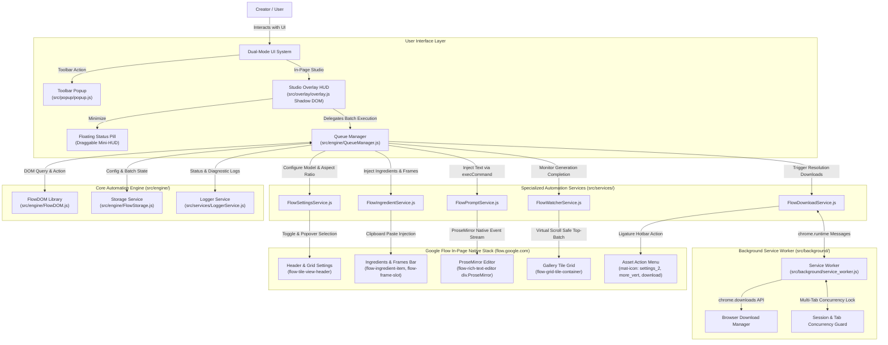

# Architecture — RJ V-Flow Auto (Next-Gen v3.0)

## 1. System Overview

**RJ V-Flow Auto** is a Chromium browser extension (Manifest V3) specifically engineered for automated multi-mode AI image and video generation on **Google Flow** (`flow.google.com`).

The extension eliminates the fragile, deprecated Chrome DevTools Protocol (`chrome.debugger`) architecture of legacy v2.x in favor of a clean, modern **Zero-CDP Native Event Stream Protocol** and an in-page **Studio Overlay HUD** encapsulated in Shadow DOM.



---

## 2. Technology Stack

| Layer | Technology | Purpose & Architectural Notes |
| :--- | :--- | :--- |
| **Platform Standard** | Chrome Manifest V3 (MV3) | Modern browser extension standard for Chromium browsers |
| **Runtime & Architecture** | Vanilla JavaScript (ES6 Modules) | Zero bundler bloat during active development; 100% native browser module imports |
| **Production Bundler** | `esbuild` + `javascript-obfuscator` | Bundle-first release pipeline resolving module dependencies into obfuscated build |
| **Design System** | Raycast Dark Precision (`DESIGN.md`) | Dark canvas `#07080a`, cyan accent `#57c1ff`, emerald success `#59d499`, strict zero native emoji |
| **Iconography** | Phosphor Icons / Lucide SVG | Scalable 16px/20px inline SVG components |
| **UI Encapsulation** | Open-Mode Shadow DOM (`#flow-auto-hud-root`) | Complete bidirectional style isolation between Google Flow and Extension HUD |
| **Storage Engine** | `chrome.storage.local` | Batch state persistence, prompt queues, settings presets, coordinate memory |
| **DOM Protocol** | Zero-CDP Native Event Stream | Text injection via `execCommand('insertText')` + native `input` & `Enter` dispatch |
| **Target Framework** | Angular Custom Elements + Angular Material & CDK | Integration target on `flow.google.com` |

---

## 3. Zero-CDP Protocol Deep Dive

### A. Why CDP (`chrome.debugger`) Was Purged
In legacy v2.x, the extension attached Chrome DevTools Protocol (`chrome.debugger`) to simulate `isTrusted: true` events under the erroneous assumption that Google Flow's editor was Slate.js / React.

This legacy approach had severe drawbacks:
1. **Intrusive Warning Banners**: Chrome displays a prominent yellow banner (`"RJ V-Flow Auto started debugging this browser"`), creating poor user trust.
2. **Anti-Bot & Security Triggers**: Automated debugging sessions trigger anti-bot heuristics on Google infrastructure, risking account restrictions.
3. **Session Fragility**: Network disconnections, tab reloads, or unexpected popup closures frequently detached the debugger, bricking the automation pipeline.

### B. The Native Event Stream Alternative
Reverse engineering confirmed that Google Flow runs on **Angular Custom Elements** (`<flow-*>`) with a native **ProseMirror** rich text editor (`flow-rich-text-editor div.ProseMirror`).

ProseMirror does **not** require CDP or `isTrusted: true` synthetic events. It natively listens to standard browser input streams:
1. **Focus Target**: Focus `div.ProseMirror` using `editor.focus()`.
2. **Selection Range**: Select any existing contents using `window.getSelection()`.
3. **Native Text Injection**: Execute `document.execCommand('insertText', false, promptText)`. This triggers ProseMirror's internal document transaction natively.
4. **Input Event Dispatch**: Dispatch a native `new InputEvent('input', { bubbles: true, cancelable: true, inputType: 'insertText', data: promptText })`.
5. **Form Submission**: Dispatch `KeyboardEvent('keydown', { key: 'Enter', code: 'Enter', keyCode: 13, which: 13, bubbles: true })` or trigger `.click()` on the native generate button (`button.generate-icon-button`).

---

## 4. Google Flow Native Subsystems & Integration Points

### A. Material Symbols Ligature Mechanics (100% Multi-Language Resilience)
Google Flow relies on the Google Material Symbols ligature font for its iconography.

```html
<mat-icon class="mat-icon material-symbols-outlined">settings_2</mat-icon>
<mat-icon class="mat-icon material-symbols-outlined">more_vert</mat-icon>
<mat-icon class="mat-icon material-symbols-outlined">download</mat-icon>
```

Ligature font mechanics translate character strings into vector glyphs in the rendering engine. Consequently:
- Ligature text nodes (`"settings_2"`, `"more_vert"`, `"download"`, `"arrow_forward"`, `"swap_horiz"`, `"cancel"`) are internal font identifiers.
- **They are never translated by Google Translate or browser language locales.**
- Selectors querying `mat-icon:has-text("settings_2")` are 100% resilient across English, Spanish, Indonesian, Japanese, German, and French interfaces.

### B. Creative Agent Mode Suppression
Google Flow features a built-in "Creative Agent" (`flow-agent-mode-toggle-chip button.agent-mode-chip`) that intercepts user prompts to rewrite them. This interferes with deterministic batch queues.
The automation engine inspects `button.agent-mode-chip-checked` on every cycle and automatically clicks it to enforce direct generation mode.

### C. In-Card Failure Detection (Zero Toast Dependency)
Google Flow **does not display toast notifications** for content moderation policy blocks, system timeouts, or quota rejections.
Instead, failed tiles remain in a permanent blurred state with warning icon badges inside the card component.
The automation engine detects completion through `isCardGenerationSuccess(card)`:
- Confirms the tile has exited loading/rendering state (`flow-tile-loading` absent).
- Validates the presence of a valid generated video or image element (`video[src]` or `img[src]`).
- Verifies that error indicator overlays (`mat-icon:has-text("warning")` or `.error-badge`) are absent.

### D. Angular CDK Virtual Scroll Safety
The gallery view (`flow-grid-tile-container`) is powered by Angular CDK Virtual Scroll (`cdk-virtual-scroll-viewport`). As the user scrolls down, older tiles are removed from the DOM.
To guarantee reliable state detection:
- The watcher always monitors index 0 (`flow-grid-tile-container > :first-child`) for the active batch.
- Historic tiles are never queried from the live DOM once scrolled out of view.

---

## 5. Dual-Mode UI & Shadow DOM Isolation

### A. Minimalist Toolbar Popup (`src/popup/`)
- Compact footprint (~320px x 180px).
- Status indicator showing whether the active tab is Google Flow.
- Direct launch button to focus or open Google Flow and toggle the Studio HUD.

### B. In-Page Studio Overlay HUD (`src/overlay/`)
The Studio HUD is injected into Google Flow tabs inside an open-mode Shadow DOM host:
```javascript
const host = document.createElement('div');
host.id = 'flow-auto-hud-root';
const shadow = host.attachShadow({ mode: 'open' });
```
- **Total CSS Isolation**: Prevents Google Flow's Angular Material stylesheets from contaminating extension UI tokens, and prevents extension styles from breaking Google Flow layout.
- **Two-Column Studio Layout**:
  - **Left Column (Queue Builder)**: Dynamic dropzone and prompt rows supporting Text-to-Image/Video, 1-Ingredient Image-to-Video, and 2-Frames Video.
  - **Right Column (Parameters Sidebar)**: Model family dropdown, aspect ratio toggle, duration selector, and resolution settings.
- **Collapsible Floating Pill**: Minimizes into a draggable 32px floating pill displaying live batch progress (`#3/12 (45%)`), allowing unobstructed observation of canvas generations.
