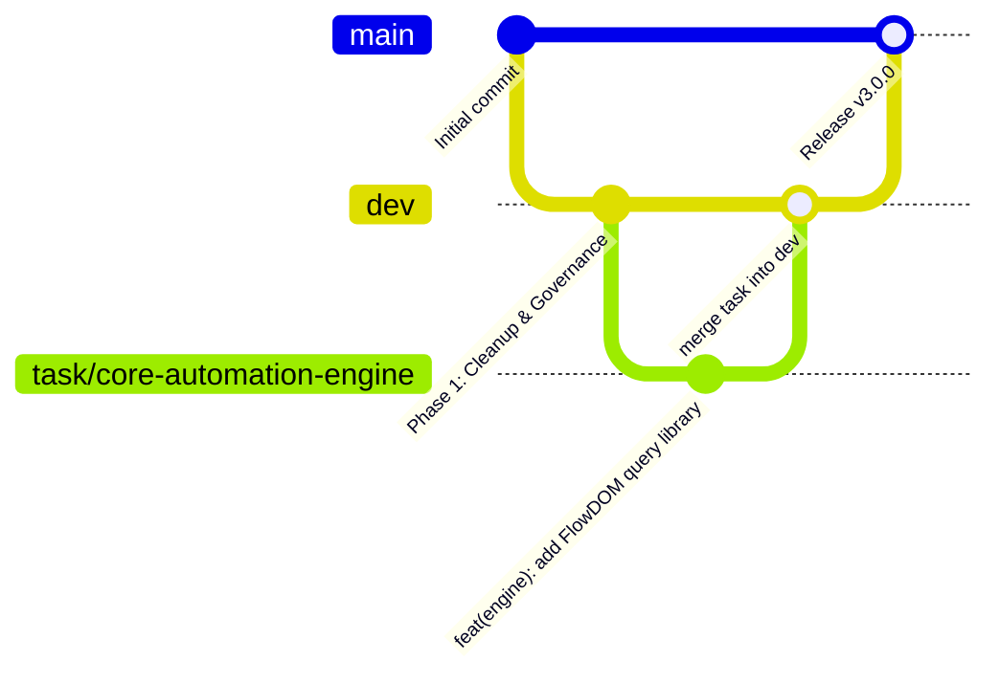

# Git Policy — RJ V-Flow Auto Extension

## 1. Branch Hierarchy



- **`main`**: Production and stable public releases only. Direct commits to `main` are strictly forbidden.
- **`dev`**: Active integration branch. All completed task branches merge into `dev`. Must always remain stable and loadable via `chrome://extensions`.
- **`legacy`**: Dedicated remote archive branch preserving the entire historical v2.x codebase and commit history.
- **`task/*`**: Working branches branched from `dev`. All feature implementation, refactoring, and bug fixes occur exclusively in task branches.

---

## 2. Branch Naming Conventions

Format: `task/<kebab-case-description>`

- Short, descriptive, and all lowercase with hyphen-separated words.
- **Do NOT include phase number prefixes** (e.g. use `task/core-automation-engine`, not `task/phase2-engine`).

| Valid Branch Names | Invalid Branch Names |
| :--- | :--- |
| `task/cleanup-and-governance` | `task/phase1-cleanup` (no phase number prefix) |
| `task/core-automation-engine` | `feature/engine` (use `task/` prefix) |
| `task/dual-mode-ui` | `task/DualModeUI` (must be lowercase kebab-case) |
| `task/download-service-hardening` | `fix/download-bug` (use `task/` prefix) |

---

## 3. Conventional Commit Format

All commits must strictly adhere to the Conventional Commits specification:

```
<type>(<scope>): <description>

[optional body explaining WHY, not WHAT]
```

- **Subject Line**: Maximum 72 characters, lowercase type and scope, imperative mood ("add", "fix", "refactor" — not "added", "fixing").
- **Types**:
  - `feat`: New feature or user-facing capability.
  - `fix`: Bug fix or selector correction.
  - `refactor`: Code change that neither fixes a bug nor adds a feature.
  - `docs`: Documentation additions or modifications only.
  - `style`: CSS styling or code formatting adjustments without logic changes.
  - `chore`: Repository configuration, `.gitignore`, or scaffolding.
  - `test`: Adding or modifying test scripts.
- **Commit Body**: Explains the rationale, design decisions, and architectural impact.

### Examples:
```
chore(cleanup): purge root zip archives, legacy version folders, and obsolete UI scripts
docs(governance): establish complete documentation suite adhering to DOCS_STYLE and port GOOGLE_FLOW_DOM
feat(engine): implement ProseMirror native text injection protocol
fix(watcher): resolve Angular CDK virtual scroll tile indexing race condition
```

---

## 4. Merge Policy

- Always use non-fast-forward merge:
  ```bash
  git checkout dev
  git merge --no-ff task/<branch-name>
  ```
- This preserves the complete historical context and atomic commits of each feature task branch.

---

## 5. Remote Push Policy

- **No Unauthorized Remote Pushes**: AI agents and automated tools must **NEVER** push to remote `origin` without explicit user instruction.
- Feature branches and task commits must remain strictly local until review is complete.

---

## 6. Prohibited Files & Repository Hygiene

The following files and directories must never be committed or tracked in git:
- Build artifacts and packages: `dist/`, `releases/`, `*.zip`.
- Dependency directories: `node_modules/`.
- Credentials and local configuration: `.env`, `.env.*`, `*.local`, `*.key`, `*.pem`.
- Operational logs: `logs/`, `*.log`.
- Local tooling and scratch directories: `bahan/`, `dev-tools/`, `scratch/`.
- Operating system metadata: `.DS_Store`, `Thumbs.db`.

---

## 7. Release Versioning

- Versioning follows [Semantic Versioning (SemVer)](https://semver.org/): `vMAJOR.MINOR.PATCH`.
- Releases must be synchronized across:
  1. `src/manifest.json` (`"version": "X.Y.Z"`)
  2. `CHANGELOG.md` (`## [X.Y.Z] - YYYY-MM-DD`)
  3. Git tag (`vX.Y.Z`) on `main`
