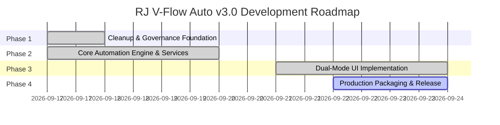

# Project Roadmap — RJ V-Flow Auto (Next-Gen v3.0)

> **Disclaimer**: This roadmap defines the master engineering sequence for the complete v3.0 refactoring. Milestones and sub-phases may be refined based on empirical in-browser testing on `flow.google.com`.

---

## Milestone Overview

---

## Phased Execution Breakdown

### Phase 1: Cleanup & Governance Foundation `[COMPLETE]`
- **Target Branch**: `task/cleanup-and-governance` $\to$ `dev`
- [x] **Sub-phase 1.1**: Git Archiving, `.gitignore` Hardening, and Docs Initiation `[COMPLETE]`
  - Commit: `8f3e5d1 chore(git): isolate and push legacy branch and harden gitignore`
- [x] **Sub-phase 1.2**: Purge Root Zip Archives, Legacy Version Folders, and Obsolete UI Scripts `[COMPLETE]`
  - Commit: `4c07274 chore(cleanup): purge root zip archives, legacy version folders, and obsolete UI scripts`
- [x] **Sub-phase 1.3**: Establish Complete Documentation Suite Adhering to `DOCS_STYLE` and Port `GOOGLE_FLOW_DOM` `[COMPLETE]`
  - Commit: `e980390 docs(governance): establish complete documentation suite adhering to DOCS_STYLE and port GOOGLE_FLOW_DOM`
- [x] **Sub-phase 1.4**: Author Root `AGENTS.md`, `DESIGN.md`, Clean MV3 Manifest, and `src/` Scaffold `[COMPLETE]`
  - Commit: `eff9539 chore(foundation): author root AGENTS.md, DESIGN.md tokens, and clean MV3 manifest`

---

### Phase 2: Core Automation Engine & Services `[COMPLETE]`
- **Target Branch**: `task/core-automation-engine` $\to$ `dev`
- [x] **Sub-phase 2.1**: Core DOM Utility Library & Storage Engine `[COMPLETE]`
  - Commit: `7251251 feat(core): implement FlowDOM selector engine and FlowStorage service`
  - Implement `src/core/FlowDOM.js` and `src/core/FlowStorage.js` with schema versioning.
- [x] **Sub-phase 2.2**: Settings Service & Creative Agent Mode Suppression `[COMPLETE]`
  - Commit: `42698d8 feat(services): implement FlowSettingsService for model, ratio, and agent suppression`
  - Implement `src/services/FlowSettingsService.js` for aspect ratio, model selection, duration, and agent mode disabling.
- [x] **Sub-phase 2.3**: Ingredients Service & ProseMirror Prompt Injection `[COMPLETE]`
  - Commit: `270cee5 feat(services): implement FlowIngredientService and FlowPromptService`
  - Implement `src/services/FlowIngredientService.js` and `src/services/FlowPromptService.js` with native clipboard and event stream injection.
- [x] **Sub-phase 2.4**: Watcher Service & In-Card Failure Detection `[COMPLETE]`
  - Commit: `e6335d3 feat(services): implement FlowWatcherService for top-batch monitoring and failure detection`
  - Implement `src/services/FlowWatcherService.js` with top-batch virtual scroll monitoring and `isCardGenerationSuccess(card)`.
- [x] **Sub-phase 2.5**: Download Service & Queue Manager Orchestrator `[COMPLETE]`
  - Commit: `feat(core): implement FlowDownloadService and QueueManager orchestrator`
  - Implement `src/services/FlowDownloadService.js` and `src/core/QueueManager.js` state machine.

---

### Phase 3: Dual-Mode UI Implementation & End-to-End Hardening `[COMPLETE]`
- **Target Branch**: `task/dual-mode-ui` $\to$ `dev`
- [x] **Sub-phase 3.1**: Minimalist Toolbar Popup Launcher `[COMPLETE]`
  - Commit: `ce3a4cb feat(popup): implement minimalist toolbar popup launcher and connection detector`
  - Implement `src/styles/variables.css`, `src/popup/popup.html`, `popup.css`, `popup.js` with connection detection and quick HUD toggle.
- [x] **Sub-phase 3.2**: Shadow DOM Studio HUD Host & Draggable Floating Pill `[COMPLETE]`
  - Commit: `7750ffe feat(overlay): implement Shadow DOM HUD host and draggable floating pill`
  - Implement `#flow-auto-hud-root` open Shadow DOM, fluid drag physics, boundary clamping, and minimize-to-pill transition.
- [x] **Sub-phase 3.3**: Two-Column Studio Layout & Queue Builder `[COMPLETE]`
  - Commit: `f808156 feat(overlay): build dynamic two-column studio HUD and template generators`
  - Implement `FlowHUDTemplates.js`, two-column workspace tabs, media dropzones, and parameters sidebar in `FlowHUDHost.js`.
- [x] **Sub-phase 3.4**: Reactive Storage Synchronization, End-to-End Orchestration & Polishing `[COMPLETE]`
  - Commits `bbd613a` through `2f6e1e4`: Reactive storage synchronization, IndexedDB `FlowImageDB` binary engine, conditional batch vs single parameter orchestration, 4-state lifecycle watcher, virtual scroll multi-row downloads, Clean Mount Protocol (eliminating FOUC), Graceful Stop engine (`STOPPING`), high-contrast disabled form states, dynamic Support Dev button, default Size S grid, and left project navigation sidebar auto-collapse.

---

### Phase 4: Production Packaging Pipeline & Release `[IN_PROGRESS]`
- **Target Branch**: `task/packaging-and-release` $\to$ `dev`
- [x] **Sub-phase 4.1**: Production Bundler, AST Obfuscation & Packaging Pipeline `[COMPLETE]`
  - Commit: `feat(build): implement production bundler, AST obfuscation, and packaging pipeline`
  - Implement `package.json`, `obfuscator.config.js`, and `build.js` mirroring RJ AIO Metadata architecture. Bundles ES modules via `esbuild`, applies AST obfuscation via `javascript-obfuscator`, copies distribution URLs (`SC.url`, `SUPPORT ME.url`), and produces clean `dist/LOAD THIS FOLDER/` and `releases/v3.0.0.zip`.
- [ ] **Sub-phase 4.2**: Factual Documentation Overhaul & Milestone Finalization `[IN_PROGRESS]`
  - Finalize all project documentation (`docs/ARCHITECTURE.md`, `README.md`, `DESIGN.md`, `CHANGELOG.md`, `docs/CURRENT_STATE.md`, `docs/HANDOFF.md`) to 100% reflect the factual codebase, synchronize release version across `src/manifest.json` and `CHANGELOG.md`, and merge `dev` into `main`.
