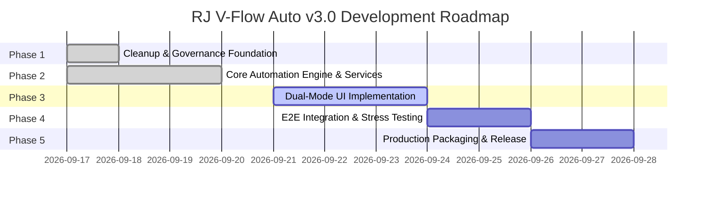

# Project Roadmap — RJ V-Flow Auto (Next-Gen v3.0)

> **Disclaimer**: This roadmap defines the master engineering sequence for the complete v3.0 refactoring. Milestones and sub-phases may be refined based on empirical in-browser testing on `flow.google.com`.

---

## Milestone Overview

---

## Phased Execution Breakdown

### Phase 1: Cleanup & Governance Foundation `[COMPLETE]`
- **Target Branch**: `task/cleanup-and-governance` $\to$ `dev`
- [x] **Sub-phase 1.1**: Git Archiving, `.gitignore` Hardening, and Docs Initiation `[COMPLETE]`
  - Commit: `8f3e5d1 chore(git): isolate and push legacy branch and harden gitignore`
- [x] **Sub-phase 1.2**: Purge Root Zip Archives, Legacy Version Folders, and Obsolete UI Scripts `[COMPLETE]`
  - Commit: `4c07274 chore(cleanup): purge root zip archives, legacy version folders, and obsolete UI scripts`
- [x] **Sub-phase 1.3**: Establish Complete Documentation Suite Adhering to `DOCS_STYLE` and Port `GOOGLE_FLOW_DOM` `[COMPLETE]`
  - Commit: `e980390 docs(governance): establish complete documentation suite adhering to DOCS_STYLE and port GOOGLE_FLOW_DOM`
- [x] **Sub-phase 1.4**: Author Root `AGENTS.md`, `DESIGN.md`, Clean MV3 Manifest, and `src/` Scaffold `[COMPLETE]`
  - Commit: `eff9539 chore(foundation): author root AGENTS.md, DESIGN.md tokens, and clean MV3 manifest`

---

### Phase 2: Core Automation Engine & Services `[COMPLETE]`
- **Target Branch**: `task/core-automation-engine` $\to$ `dev`
- [x] **Sub-phase 2.1**: Core DOM Utility Library & Storage Engine `[COMPLETE]`
  - Commit: `7251251 feat(core): implement FlowDOM selector engine and FlowStorage service`
  - Implement `src/core/FlowDOM.js` and `src/core/FlowStorage.js` with schema versioning.
- [x] **Sub-phase 2.2**: Settings Service & Creative Agent Mode Suppression `[COMPLETE]`
  - Commit: `42698d8 feat(services): implement FlowSettingsService for model, ratio, and agent suppression`
  - Implement `src/services/FlowSettingsService.js` for aspect ratio, model selection, duration, and agent mode disabling.
- [x] **Sub-phase 2.3**: Ingredients Service & ProseMirror Prompt Injection `[COMPLETE]`
  - Commit: `270cee5 feat(services): implement FlowIngredientService and FlowPromptService`
  - Implement `src/services/FlowIngredientService.js` and `src/services/FlowPromptService.js` with native clipboard and event stream injection.
- [x] **Sub-phase 2.4**: Watcher Service & In-Card Failure Detection `[COMPLETE]`
  - Commit: `e6335d3 feat(services): implement FlowWatcherService for top-batch monitoring and failure detection`
  - Implement `src/services/FlowWatcherService.js` with top-batch virtual scroll monitoring and `isCardGenerationSuccess(card)`.
- [x] **Sub-phase 2.5**: Download Service & Queue Manager Orchestrator `[COMPLETE]`
  - Commit: `feat(core): implement FlowDownloadService and QueueManager orchestrator`
  - Implement `src/services/FlowDownloadService.js` and `src/core/QueueManager.js` state machine.

---

### Phase 3: Dual-Mode UI Implementation `[PLANNED]`
- **Target Branch**: `task/dual-mode-ui` $\to$ `dev`
- [ ] **Sub-phase 3.1**: Minimalist Toolbar Popup Launcher `[PLANNED]`
  - Implement `src/popup/popup.html`, `popup.css`, `popup.js` with connection detection and quick HUD toggle.
- [ ] **Sub-phase 3.2**: Shadow DOM Studio HUD Host & Draggable Floating Pill `[PLANNED]`
  - Implement `#flow-auto-hud-root` open Shadow DOM, fluid drag physics, boundary clamping, and minimize-to-pill transition.
- [ ] **Sub-phase 3.3**: Two-Column Studio Layout & Queue Builder `[PLANNED]`
  - Implement dynamic Left Column (States A, B, C, D) and Right Column (Parameters sidebar) adhering to Raycast Dark Precision design tokens.
- [ ] **Sub-phase 3.4**: Reactive Storage Synchronization & Automation Controls `[PLANNED]`
  - Connect Start, Stop, and Pause controls with live status ticker and auto-save state recovery.

---

### Phase 4: End-to-End Integration & Multi-Language Stress Testing `[PLANNED]`
- **Target Branch**: `task/e2e-integration-testing` $\to$ `dev`
- [ ] **Sub-phase 4.1**: Text-to-Image & Text-to-Video Batch Validation `[PLANNED]`
  - Multi-prompt automated generation across Omni 1.1 Flash and Veo 3.1 models.
- [ ] **Sub-phase 4.2**: Image-to-Video & Frames-to-Video Multi-Asset Injection `[PLANNED]`
  - Single-ingredient and start/end frame automated pairing and submission.
- [ ] **Sub-phase 4.3**: Failure Handling & System Recovery Stress Test `[PLANNED]`
  - In-card moderation blocks, quota limits, and network stall auto-healing.
- [ ] **Sub-phase 4.4**: Multi-Language Locale Verification `[PLANNED]`
  - Verify 100% selector resilience on non-English locales (Indonesian, Spanish, Japanese, German, French).

---

### Phase 5: Production Packaging Pipeline & Release `[PLANNED]`
- **Target Branch**: `task/packaging-and-release` $\to$ `dev`
- [ ] **Sub-phase 5.1**: Production Bundler & AST Obfuscation Pipeline `[PLANNED]`
  - Configure `esbuild` and `javascript-obfuscator` build script.
- [ ] **Sub-phase 5.2**: Release Packaging (`dist/` & `releases/v3.0.0.zip`) `[PLANNED]`
  - Output clean `dist/LOAD THIS FOLDER/` and verified zip archive.
- [ ] **Sub-phase 5.3**: Release Documentation & Milestone Finalization `[PLANNED]`
  - Finalize `CHANGELOG.md`, synchronize version in `manifest.json`, and merge `dev` into `main`.
