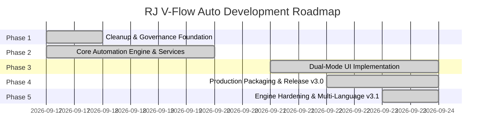

# Project Roadmap — RJ V-Flow Auto

> **Master Engineering Sequence**: This roadmap documents the phased refactoring and milestone execution from cleanup foundation through production release.

---

## Milestone Overview

---

## Phased Execution Breakdown

### Phase 1: Cleanup & Governance Foundation `[COMPLETE]`
- **Target Branch**: `task/cleanup-and-governance` $\to$ `dev`
- [x] **Sub-phase 1.1**: Git Archiving, `.gitignore` Hardening, and Docs Initiation `[COMPLETE]`
  - Commit: `8f3e5d1 chore(git): isolate and push legacy branch and harden gitignore`
- [x] **Sub-phase 1.2**: Purge Root Zip Archives, Legacy Version Folders, and Obsolete UI Scripts `[COMPLETE]`
  - Commit: `4c07274 chore(cleanup): purge root zip archives, legacy version folders, and obsolete UI scripts`
- [x] **Sub-phase 1.3**: Establish Complete Documentation Suite Adhering to `DOCS_STYLE` and Port `GOOGLE_FLOW_DOM` `[COMPLETE]`
  - Commit: `e980390 docs(governance): establish complete documentation suite adhering to DOCS_STYLE and port GOOGLE_FLOW_DOM`
- [x] **Sub-phase 1.4**: Author Root `AGENTS.md`, `DESIGN.md`, Clean MV3 Manifest, and `src/` Scaffold `[COMPLETE]`
  - Commit: `eff9539 chore(foundation): author root AGENTS.md, DESIGN.md tokens, and clean MV3 manifest`

---

### Phase 2: Core Automation Engine & Services `[COMPLETE]`
- **Target Branch**: `task/core-automation-engine` $\to$ `dev`
- [x] **Sub-phase 2.1**: Core DOM Utility Library & Storage Engine `[COMPLETE]`
  - Commit: `7251251 feat(core): implement FlowDOM selector engine and FlowStorage service`
  - Implemented `src/core/FlowDOM.js` and `src/core/FlowStorage.js` with schema versioning.
- [x] **Sub-phase 2.2**: Settings Service & Creative Agent Mode Suppression `[COMPLETE]`
  - Commit: `42698d8 feat(services): implement FlowSettingsService for model, ratio, and agent suppression`
  - Implemented `src/services/FlowSettingsService.js` for aspect ratio, model selection, duration, and agent mode disabling.
- [x] **Sub-phase 2.3**: Ingredients Service & ProseMirror Prompt Injection `[COMPLETE]`
  - Commit: `270cee5 feat(services): implement FlowIngredientService and FlowPromptService`
  - Implemented `src/services/FlowIngredientService.js` and `src/services/FlowPromptService.js` with native clipboard and event stream injection.
- [x] **Sub-phase 2.4**: Watcher Service & In-Card Failure Detection `[COMPLETE]`
  - Commit: `e6335d3 feat(services): implement FlowWatcherService for top-batch monitoring and failure detection`
  - Implemented `src/services/FlowWatcherService.js` with virtual scroll monitoring and `isCardGenerationSuccess(card)`.
- [x] **Sub-phase 2.5**: Download Service & Queue Manager Orchestrator `[COMPLETE]`
  - Commit: `feat(core): implement FlowDownloadService and QueueManager orchestrator`
  - Implemented `src/services/FlowDownloadService.js` and `src/core/QueueManager.js` state machine.

---

### Phase 3: Dual-Mode UI Implementation & End-to-End Hardening `[COMPLETE]`
- **Target Branch**: `task/dual-mode-ui` $\to$ `dev`
- [x] **Sub-phase 3.1**: Minimalist Toolbar Popup Launcher `[COMPLETE]`
  - Commit: `ce3a4cb feat(popup): implement minimalist toolbar popup launcher and connection detector`
  - Implemented `src/styles/variables.css`, `src/popup/popup.html`, `popup.css`, `popup.js` with connection detection and quick HUD toggle.
- [x] **Sub-phase 3.2**: Shadow DOM Studio HUD Host & Draggable Floating Pill `[COMPLETE]`
  - Commit: `7750ffe feat(overlay): implement Shadow DOM HUD host and draggable floating pill`
  - Implemented `#flow-auto-hud-root` open Shadow DOM, fluid drag physics, boundary clamping, and minimize-to-pill transition.
- [x] **Sub-phase 3.3**: Two-Column Studio Layout & Queue Builder `[COMPLETE]`
  - Commit: `f808156 feat(overlay): build dynamic two-column studio HUD and template generators`
  - Implemented `FlowHUDTemplates.js`, two-column workspace tabs, media dropzones, and parameters sidebar in `FlowHUDHost.js`.
- [x] **Sub-phase 3.4**: Reactive Storage Synchronization, End-to-End Orchestration & Polishing `[COMPLETE]`
  - Commits `bbd613a` through `2f6e1e4`: Reactive storage synchronization, IndexedDB `FlowImageDB` binary engine, conditional batch vs single parameter orchestration, 4-state lifecycle watcher, virtual scroll multi-row downloads, Clean Mount Protocol (eliminating FOUC), Graceful Stop engine (`STOPPING`), high-contrast disabled form states, dynamic Support Dev button, default Size S grid, and left project navigation sidebar auto-collapse.

---

### Phase 4: Production Packaging Pipeline & Release `[COMPLETE]`
- **Target Branch**: `task/packaging-and-release` $\to$ `dev`
- [x] **Sub-phase 4.1**: Production Bundler, AST Obfuscation & Packaging Pipeline `[COMPLETE]`
  - Commit: `6d6374c feat(build): implement production bundler, AST obfuscation, and packaging pipeline`
  - Implemented `package.json`, `obfuscator.config.js`, and `build.js` mirroring RJ AIO Metadata architecture. Bundles ES modules via `esbuild`, applies AST obfuscation via `javascript-obfuscator`, copies distribution URLs (`SC.url`, `SUPPORT ME.url`), and produces clean `dist/LOAD THIS FOLDER/` and `releases/RJ_V-Flow_Auto-v3.0.0.zip`.
- [x] **Sub-phase 4.2**: Factual Documentation Overhaul & Milestone Finalization `[COMPLETE]`
  - Overhauled all project documentation (`docs/ARCHITECTURE.md`, `README.md`, `CHANGELOG.md`, `docs/DECISIONS.md`, `docs/CURRENT_STATE.md`, `docs/HANDOFF.md`, `docs/ROADMAP.md`) to 100% reflect the factual codebase, removed `(Next-Gen v3.0)` suffixes, synchronized release version across `src/manifest.json` and `CHANGELOG.md`, and prepared final merge into `dev` and `main`.

---

### Phase 5: Post-Release Engine Hardening & Multi-Language Modernization (v3.1.0) `[COMPLETE]`
- **Target Branch**: `task/fix-image-generation-trigger` $\to$ `dev`
- [x] **Sub-phase 5.1**: Option C MAIN-World reCAPTCHA Hook & batchexecute RPC Bridge `[COMPLETE]`
  - Bypassed 0-credit synthetic DOM button click dropping on Nano Banana models by establishing a unified `simulateHumanClick` click pipeline pre-armed with fresh reCAPTCHA Enterprise tokens minted in the MAIN world.
- [x] **Sub-phase 5.2**: Pure Background Image RPC Engine (`ogiZ0b` & `maseQ`) & Native SPrCad AI Upscaling `[COMPLETE]`
  - Completely decoupled image generation and editing from Google Flow's DOM. Uploads reference images via `maseQ` RPC, generates via `ogiZ0b` RPC, upscales to 2K/4K via native `SPrCad` RPC with tiered fallback (`4K -> 2K -> 1K/Original`), and fetches authenticated binaries in-page to eliminate 403 `AccessDenied` download errors.
- [x] **Sub-phase 5.3**: Finished Queue Dual Action Buttons & Omni Duration Synchronization `[COMPLETE]`
  - Implemented dynamic `#btnClearAllQueue` (`Clear all`) and `#btnResetQueue` (`Reset queue`) buttons upon queue completion. Resetting restores all rows to `READY` while preserving 100% of prompt text, uploaded ingredients, frames, and parameter bindings. Fixed Omni 1.1 Flash duration controls visibility in single row mode.
- [x] **Sub-phase 5.4**: Multi-Language Resilient DOM Engine & Localization Audit `[COMPLETE]`
  - Audited forensic captures on Indonesian (`id-ID`) systems. Resolved Grid Size S setup failure where `span:has-text("S")` collided with Indonesian 'Sedang' (Medium) instead of 'Kecil' (Small). Replaced text queries with structural positional LTR indexing (`index 0 = Small`, `index 1 = Medium`, `index 2 = Large`). Added Material Symbols ligatures `ink_eraser` and `chrome_extension`, and implemented numeric duration matching (`\d+`) across all global locales. Purged all remaining English text strings in compliance with `AGENTS.md` Rule 3.B.

